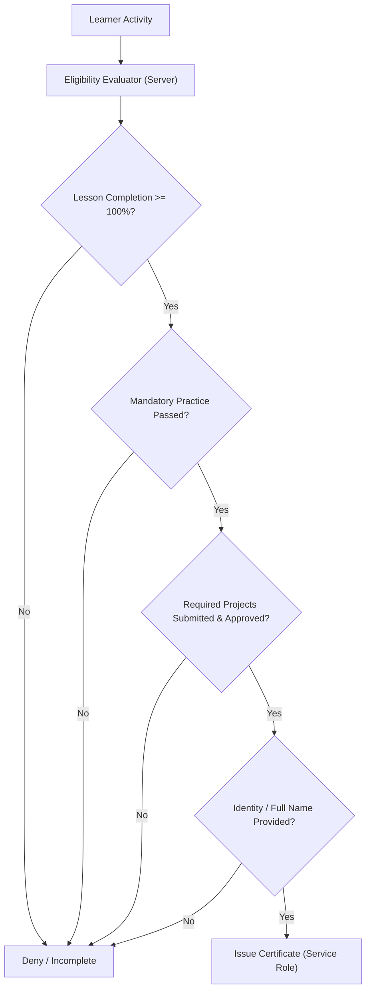
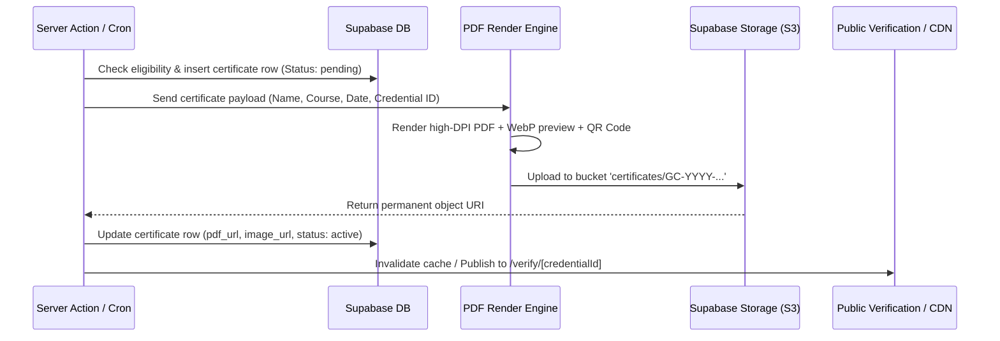

# Certificate System Architecture & Specification

## 1. Executive Summary & Current State Audit

Gradient Code offers verified certificates upon successful course completion. This document specifies the comprehensive future architecture for eligibility evaluation, automated issuance, cryptographic verification, and credential lifecycle management.

### Current Implementation State (2026-10-01)
| Component | Status | Location / Implementation Details |
|---|---|---|
| **Policies** | ✅ | `certificate_policies` per course (off by default; % required lessons, % practice correct, credential code) |
| **Eligibility** | ✅ | `certificate_eligibility()` recomputes from DB facts on every call |
| **Issuance** | ✅ | `issue_certificate()` RPC only; students cannot insert. IDs `GC-YYYY-CODE-XXXXXXXX` |
| **Verification** | ✅ | `/verify` → `/verify/[id]` via `verify_certificate()` (name, course, date, validity) |
| **Printable certificate** | ✅ | `/certificate/[id]` (browser print → PDF, A4 landscape). No server PDF/QR yet |
| **Admin** | ✅ | `/admin/certificates` (search, revoke with reason, reinstate), `/admin/certificates/policies`. Refund revokes |
| **Not built** | ⏳ | Quizzes/projects as requirements, QR codes, emailed certificates, HMAC integrity hash |

Sections below are the original design document; where they differ from the shipped migration `20260930110000_certificates.sql`, the migration wins.

---|---|---|
| **Learner UI** | ⚠️ Partial | `/dashboard/certificates` lists certificates; `/learn/[slug]/certificate` shows status card |
| **Eligibility Gate** | ⚠️ Placeholder | `src/components/learn/eligibility-placeholder.tsx` renders static requirements checklist |
| **Database Schema** | ⚠️ Basic | Table `public.certificates` (`id`, `user_id`, `course_id`, `certificate_number`, `issue_date`, `created_at`) |
| **RLS Policies** | ✅ Secured | Insert restricted to administrators and service role (`20260929090000_learning_portal_practice.sql`). Self-issuance disabled |
| **Automated Issuance** | ❌ Not Implemented | No background job, trigger, or server action automatically evaluates eligibility or issues certificates |
| **PDF Generation** | ❌ Not Implemented | No rendering pipeline for PDF generation or certificate image assets |
| **Public Verification** | ⚠️ Stub | Route `/verify` exists but lacks dynamic cryptographic/database record lookup |
| **Admin Controls** | ❌ Not Implemented | Admin panel cannot revoke, re-issue, or manually audit eligibility exceptions |

---

## 2. Certificate Eligibility Engine

Eligibility must be computed **server-side** and verified before any certificate row is created.

### 2.1 Criteria Matrix per Course
To unlock a certificate, a learner must satisfy all configured policy dimensions for the course:



1. **Course Progress:**
   - 100% of all published, non-optional lessons marked complete.
   - For video lessons: verified playback threshold (minimum 90% watched where telemetry is available).
2. **Practice & Assessments:**
   - Passing score (minimum 70% or course-specific threshold) on all end-of-module quizzes and practice milestones.
3. **Project Review:**
   - Approval of capstone project submissions (status = `approved` in `project_submissions`).
4. **Learner Identity Verification:**
   - Verified legal full name in `profiles.full_name` (students are required to confirm this prior to certificate generation to prevent fraudulent name changes).

### 2.2 Proposed Policy Configuration Schema
Rather than hardcoding rules in code, course policies should be defined in a dedicated table:

```sql
CREATE TABLE IF NOT EXISTS public.certificate_policies (
  id UUID PRIMARY KEY DEFAULT gen_random_uuid(),
  course_id UUID NOT NULL REFERENCES public.courses(id) ON DELETE CASCADE UNIQUE,
  min_lesson_progress SMALLINT NOT NULL DEFAULT 100,
  min_quiz_score SMALLINT NOT NULL DEFAULT 70,
  require_capstone_project BOOLEAN NOT NULL DEFAULT false,
  require_identity_verification BOOLEAN NOT NULL DEFAULT true,
  is_active BOOLEAN NOT NULL DEFAULT true,
  created_at TIMESTAMPTZ NOT NULL DEFAULT now()
);
```

---

## 3. Credential Identification & Cryptographic Security

### 3.1 Credential ID Format
Every issued certificate must receive a deterministic, human-readable, and globally unique credential identifier:

$$\text{Format: } \mathbf{GC\text{-}YYYY\text{-}[COURSE\_CODE]\text{-}[RANDOM\_TOKEN]}$$

- `GC`: Organization prefix (Gradient Code).
- `YYYY`: Year of issuance (e.g., `2026`).
- `COURSE_CODE`: Uppercase course abbreviation (e.g., `FSAI` for Full Stack AI, `GENAI` for Generative AI, `DSAI` for Data Science AI).
- `RANDOM_TOKEN`: 6–8 alphanumeric, non-sequential characters (excluding ambiguous characters `0/O`, `1/I/l`) for collision prevention and unguessable enumeration.
- *Example:* `GC-2026-FSAI-8K2MN4`

### 3.2 Integrity Verification Hash
To prevent external forgery or PDF manipulation:
- Store a SHA-256 HMAC hash generated with a server secret:
  $$\text{Hash} = \text{HMAC-SHA256}(\text{key}, \text{certificate\_id} \parallel \text{user\_id} \parallel \text{issue\_date})$$
- Embed this hash as a metadata field and encode it in the certificate QR code.

---

## 4. PDF Generation & Asset Pipeline



### 4.1 Recommended Technology Stack
1. **Renderer:** `@react-pdf/renderer` or serverless headless Chromium (`@sparticuz/chromium` + `puppeteer-core`) on Vercel Serverless Functions.
2. **Formats Generated:**
   - **Vector PDF:** Archival quality (PDF/A), embedded Inter fonts, print-ready 300 DPI, vector SVG logo and badge.
   - **Social Preview Image (PNG/WebP):** 1200×630 OpenGraph dimensions for LinkedIn, Twitter, and WhatsApp previews.
3. **Storage:**
   - Dedicated Supabase Storage bucket: `certificates`.
   - Access: Public read for generated PDFs/previews; upload restricted strictly to service role.

---

## 5. Public Verification & Sharing

### 5.1 Verification Route: `/verify/[credentialId]`
The verification page must serve as an authoritative, public proof-of-authenticity page:
- **Real-time Status:** Valid, Revoked, or Expired.
- **Recipient Details:** Legal recipient name (with privacy option to mask surname if requested).
- **Course & Curriculum Completed:** Course title, hours of study, skills mastered, capstone project title.
- **Issuance Date & Expiry:** Date completed, certificate validity period.
- **Actions:**
  - "Download Original PDF"
  - "View Credential on LinkedIn"
  - "Copy Verification Link"

### 5.2 LinkedIn Add-to-Profile Integration
Provide direct URL generation conforming to LinkedIn's official credential specifications:
```
https://www.linkedin.com/profile/add?startTask=CERTIFICATION_NAME
  &name=Full+Stack+Web+Development+with+AI+%26+ML
  &organizationName=Gradient+Code
  &organizationId=[GRADIENT_CODE_LINKEDIN_ORG_ID]
  &issueYear=2026
  &issueMonth=09
  &certUrl=https://gradientcode.in/verify/GC-2026-FSAI-8K2MN4
  &certId=GC-2026-FSAI-8K2MN4
```

---

## 6. Revocation & Audit Lifecycle

Certificates can be revoked in cases of academic dishonesty, chargebacks/refunds, or administrative errors:
1. `status` column on `certificates`: `active` | `revoked` | `expired`.
2. `revocation_reason`: Text description (e.g., "Course refunded within refund window").
3. `revoked_at`: Timestamp.
4. On `/verify/[credentialId]`, revoked credentials show an unmistakable warning banner and disable PDF downloads.

---

## 7. Migration & Implementation Phasing

- **Phase 2 (Current):** Database locked against student self-issuance; eligibility UI placeholders present.
- **Phase 5 (Next):** Implement `certificate_policies` table, automated evaluation RPC, PDF generation worker, and `/verify/[credentialId]` public lookup.
