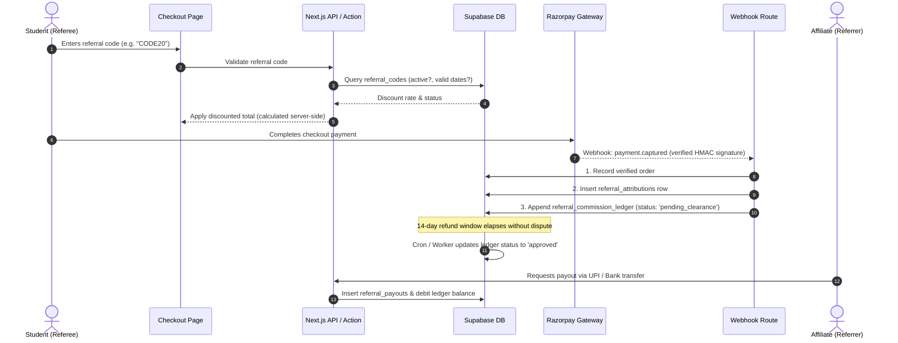

# Referral & Affiliate System Architecture

## 1. System Confirmation & Current Status

**Current Status (Phase 2):**
- Referral and affiliate tracking functionality **does not currently exist** in the Gradient Code application or database schema.
- Payment gateway integration (Razorpay) is currently an unauthenticated checkout mockup (Phase 7).
- **Rule:** Referral processing must **never** precede verified payment capture, and must remain completely decoupled from core payroll, teacher stipends, and internal operations.

---

## 2. Core Architectural Principles

1. **Explicit Referral Codes over Raw User IDs:**
   - Referrers share personalized, branded referral codes (e.g. `ALOK10`, `GRADIENT-DEV`) rather than raw internal user UUIDs.
   - Prevents database ID enumeration, simplifies attribution across marketing channels, and allows custom promotional naming.

2. **Zero-Trust Commission Crediting:**
   - A referral attribution is created in state `attributed` upon checkout, but **no commission entry is credited to the payable balance** until Razorpay's server-to-server webhook emits `payment.captured` with signature verification.
   - Client-reported payment success is never trusted.

3. **Refund Window & Dispute Holdback:**
   - All credited commissions enter a mandatory `pending_clearance` state for the duration of the platform refund policy (e.g., 14 days).
   - If an order is refunded or charged back, the commission is transitioned to `cancelled`.

4. **Strict Isolation from Payroll & Salaries:**
   - Referral earnings are recorded in an append-only double-entry financial ledger (`referral_commission_ledger`). They are never merged into employee salaries or operational balances.

---

## 3. End-to-End Referral Lifecycle



---

## 4. Proposed Database Schema

```sql
-- 1. Referral Codes (Human-readable codes linked to users)
CREATE TABLE IF NOT EXISTS public.referral_codes (
  id UUID PRIMARY KEY DEFAULT gen_random_uuid(),
  user_id UUID NOT NULL REFERENCES auth.users(id) ON DELETE CASCADE,
  code TEXT NOT NULL UNIQUE,
  discount_percent SMALLINT NOT NULL DEFAULT 10 CHECK (discount_percent BETWEEN 0 AND 100),
  commission_percent SMALLINT NOT NULL DEFAULT 15 CHECK (commission_percent BETWEEN 0 AND 100),
  max_uses INTEGER,
  used_count INTEGER NOT NULL DEFAULT 0,
  is_active BOOLEAN NOT NULL DEFAULT true,
  expires_at TIMESTAMPTZ,
  created_at TIMESTAMPTZ NOT NULL DEFAULT now(),
  CONSTRAINT code_alphanumeric CHECK (code ~ '^[A-Z0-9_-]{3,20}$')
);

ALTER TABLE public.referral_codes ENABLE ROW LEVEL SECURITY;
CREATE POLICY "Users read own referral code" ON public.referral_codes FOR SELECT TO authenticated
  USING (user_id = auth.uid() OR public.has_role(auth.uid(), 'admin'));
CREATE POLICY "Admins manage referral codes" ON public.referral_codes FOR ALL TO authenticated
  USING (public.has_role(auth.uid(), 'admin')) WITH CHECK (public.has_role(auth.uid(), 'admin'));

-- 2. Referral Attributions (Order-level link between referee and referrer)
CREATE TABLE IF NOT EXISTS public.referral_attributions (
  id UUID PRIMARY KEY DEFAULT gen_random_uuid(),
  referral_code_id UUID NOT NULL REFERENCES public.referral_codes(id),
  order_id UUID NOT NULL REFERENCES public.orders(id) ON DELETE CASCADE UNIQUE,
  referrer_user_id UUID NOT NULL REFERENCES auth.users(id),
  referee_user_id UUID NOT NULL REFERENCES auth.users(id),
  order_gross_amount NUMERIC(10,2) NOT NULL,
  discount_amount NUMERIC(10,2) NOT NULL DEFAULT 0,
  net_paid_amount NUMERIC(10,2) NOT NULL,
  created_at TIMESTAMPTZ NOT NULL DEFAULT now(),
  CONSTRAINT cannot_refer_self CHECK (referrer_user_id <> referee_user_id)
);

ALTER TABLE public.referral_attributions ENABLE ROW LEVEL SECURITY;
CREATE POLICY "Referrer views own attributions" ON public.referral_attributions FOR SELECT TO authenticated
  USING (referrer_user_id = auth.uid() OR public.has_role(auth.uid(), 'admin'));

-- 3. Commission Ledger (Append-only financial records)
CREATE TYPE public.commission_status AS ENUM ('pending_clearance', 'approved', 'paid_out', 'cancelled_refund');

CREATE TABLE IF NOT EXISTS public.referral_commission_ledger (
  id UUID PRIMARY KEY DEFAULT gen_random_uuid(),
  attribution_id UUID NOT NULL REFERENCES public.referral_attributions(id),
  referrer_user_id UUID NOT NULL REFERENCES auth.users(id),
  commission_amount NUMERIC(10,2) NOT NULL CHECK (commission_amount >= 0),
  status public.commission_status NOT NULL DEFAULT 'pending_clearance',
  clearance_due_at TIMESTAMPTZ NOT NULL DEFAULT (now() + INTERVAL '14 days'),
  approved_at TIMESTAMPTZ,
  created_at TIMESTAMPTZ NOT NULL DEFAULT now()
);

ALTER TABLE public.referral_commission_ledger ENABLE ROW LEVEL SECURITY;
CREATE POLICY "Referrer reads own ledger" ON public.referral_commission_ledger FOR SELECT TO authenticated
  USING (referrer_user_id = auth.uid() OR public.has_role(auth.uid(), 'admin'));

-- 4. Payouts (Settlement records to bank/UPI)
CREATE TYPE public.payout_status AS ENUM ('requested', 'processing', 'completed', 'failed');

CREATE TABLE IF NOT EXISTS public.referral_payouts (
  id UUID PRIMARY KEY DEFAULT gen_random_uuid(),
  referrer_user_id UUID NOT NULL REFERENCES auth.users(id),
  amount NUMERIC(10,2) NOT NULL CHECK (amount >= 500), -- Minimum payout threshold
  payment_method TEXT NOT NULL CHECK (payment_method IN ('upi', 'neft', 'imps')),
  payout_identifier TEXT NOT NULL,                     -- UPI VPA or IFSC+Account hash
  transaction_reference TEXT,                         -- Bank / Gateway UTR
  status public.payout_status NOT NULL DEFAULT 'requested',
  processed_by UUID REFERENCES auth.users(id),
  processed_at TIMESTAMPTZ,
  created_at TIMESTAMPTZ NOT NULL DEFAULT now()
);

ALTER TABLE public.referral_payouts ENABLE ROW LEVEL SECURITY;
CREATE POLICY "Referrer reads own payouts" ON public.referral_payouts FOR SELECT TO authenticated
  USING (referrer_user_id = auth.uid() OR public.has_role(auth.uid(), 'admin'));
```

---

## 5. Security & Anti-Fraud Measures

1. **Self-Referral Prevention:**
   - Enforced by database constraint `cannot_refer_self` (`referrer_user_id <> referee_user_id`).
   - Cookie/IP and browser fingerprint comparison at checkout to flag accounts created by the same individual.
2. **Deterministic Coupon vs. Referral Hierarchy:**
   - A cart cannot stack conflicting affiliate codes with sitewide discount coupons unless explicitly permitted by promotional policy.
3. **Audit Trail & Immutable Records:**
   - Ledger records cannot be updated or deleted directly; status changes are strictly controlled by server functions.
